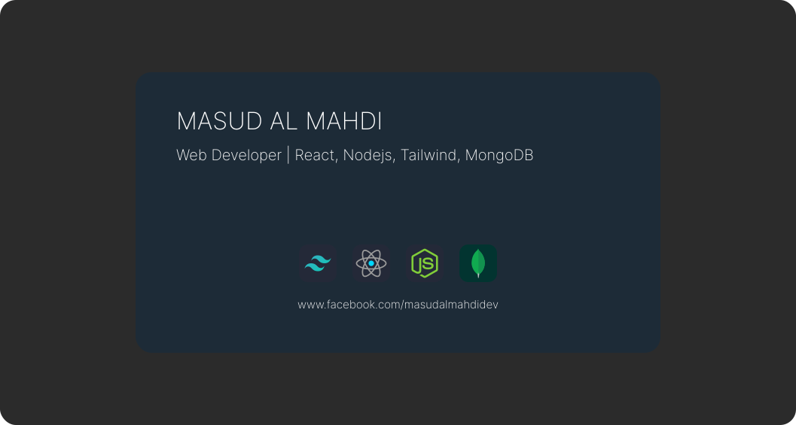

## 📈 Stats-Overview:

    
    

## 📧 Find me at:

  
  
  

## ⚡ Technologies that I Use:

 

 

## 🌃 More-About-me:
- 🔭 I’m currently working on: React Firebase Projects
- 🌱 I’m currently learning: Learning Next.JS
- 👯 I’m looking to collaborate on: New and Upcoming Technologies
- 💬 Ask me about: Development Bottlenecks & Solutions
- 📫 How to reach me: https://www.facebook.com/masudalmahdidev
- 📫 or E-mail: functionnotworkingcorrectly@gmail.com
- ⚡ More Info: I'm also good at software development with C++ & Python 😊
